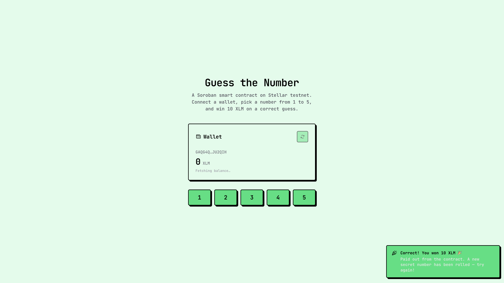

# Guess the Number — Soroban Smart Contract

A minimal Soroban smart contract that runs a "guess the number" game on Stellar. The contract picks a random secret number in `1..=5`, charges each guesser a **1 XLM** bet, pays out **10 XLM** to the winner from its own balance, and immediately rolls a new number for the next round.

> Built with `soroban-sdk = 25` against Stellar Protocol 25 (Futurenet / Testnet / Public).



## Deployed live site

[https://fe-guess-the-number-build-stellar-y.vercel.app/](https://fe-guess-the-number-build-stellar-y.vercel.app/)

## Deployed contract addresses

[Testnet: CB5HLXNF2MDPCUP7GQEWS2OM6D2S6COJ52GB3DBQ2HDRB5KFA55PI2D7](https://lab.stellar.org/r/testnet/contract/CB5HLXNF2MDPCUP7GQEWS2OM6D2S6COJ52GB3DBQ2HDRB5KFA55PI2D7)

[Lab Explorer: CB5HLXNF2MDPCUP7GQEWS2OM6D2S6COJ52GB3DBQ2HDRB5KFA55PI2D7](https://lab.stellar.org/smart-contracts/contract-explorer?$=network$id=testnet&label=Testnet&horizonUrl=https:////horizon-testnet.stellar.org&rpcUrl=https:////soroban-testnet.stellar.org&passphrase=Test%20SDF%20Network%20/;%20September%202015;&smartContracts$explorer$contractId=CB5HLXNF2MDPCUP7GQEWS2OM6D2S6COJ52GB3DBQ2HDRB5KFA55PI2D7;;)

---

## Game rules

| Event                                                       | Result                                                                                                                                 |
| ----------------------------------------------------------- | -------------------------------------------------------------------------------------------------------------------------------------- |
| Constructor runs                                            | Admin transfers **100 XLM** to the contract, contract rolls the first secret number                                                    |
| `guess(n, who)` correct (`n ∈ 1..=5` and equals the secret) | Pulls **1 XLM** bet from `who` → contract, pays **10 XLM** from contract → `who`, **auto-rolls** a new secret, returns `Ok("correct")` |
| `guess(n, who)` wrong (in-range but not equal)              | Pulls **1 XLM** bet from `who` → contract, returns `Ok("incorrect")`. Number unchanged.                                                |
| `guess(n, who)` outside `1..=5`                             | Returns `Err(InvalidGuess)`. No state change.                                                                                          |
| `who` has < 1 XLM to cover the bet                          | Returns `Err(FailedToTransferBet)`. No state change.                                                                                   |
| Correct guess but contract balance < 10 XLM                 | Returns `Err(InsufficientRewardFunds)`. **All state changes rolled back** (bet refunded).                                              |
| Reward transfer itself fails                                | Returns `Err(FailedToTransferReward)`. **All state changes rolled back** (bet refunded).                                               |

The contract is **honest by construction**: winners always get the full advertised 10 XLM, or no transfer happens at all. Soroban rolls back every state change when a contract returns an error, so a failed guess never costs the player anything.

---

## Contract API

### `__constructor(env, admin: Address, xlm: Address)`

Initializes the contract. Requires `admin.require_auth()`.

- `admin` — the account that funds the initial 100 XLM pot (must be funded first, e.g. via friendbot).
- `xlm` — the address of the XLM Stellar Asset Contract on the target network.

| Network              | XLM SAC address                                            |
| -------------------- | ---------------------------------------------------------- |
| **Testnet**          | `CDLZFC3SYJYDZT7K67VZ75HPJVIEUVNIXF47ZG2FB2RMQQVU2HHGCYSC` |
| **Public (Mainnet)** | `CAS3J7GYLGXOFYSUSJ2TYAH4EPU4QB3P4P3C3ZCHRZNSVPK3RYWPXK2P` |
| **Futurenet**        | `CABNKYN3LBWWSN4DDDYYR2MHXT23WP5Z6YBCVWQQY65ZQKQZG3Z4Q5KM` |
| **Standalone**       | Deploy your own SAC; no fixed address                      |

### `guess(env, user_number: u64, guesser: Address) -> Result<Symbol, Error>`

Submit a guess. The caller (`guesser`) must authorize a **1 XLM** transfer to the contract as the cost of playing. Returns:

- `Ok("correct")` — guess matched, 10 XLM reward paid, new secret rolled.
- `Ok("incorrect")` — guess did not match, 1 XLM bet kept by the contract, number unchanged.

Errors (all state changes are rolled back atomically by Soroban):

- `Err(InvalidGuess)` — guess outside `1..=5`.
- `Err(FailedToTransferBet)` — guesser could not cover the 1 XLM bet.
- `Err(InsufficientRewardFunds)` — contract balance < 10 XLM on a correct guess.
- `Err(FailedToTransferReward)` — reward transfer itself failed.

### `admin(env) -> Option<Address>`

Read the admin (the account that funded the contract). Read-only.

### `number(env) -> u64` _(pub(crate))_

Read the current secret. Only accessible from inside the contract — useful for tests, **not** callable from off-chain.

---

## Prerequisites

- [Rust](https://rustup.rs/) + `wasm32v1-none` target: `rustup target add wasm32v1-none`
- [Stellar CLI](https://developers.stellar.org/docs/tools/cli) v23+ (`stellar --version` to verify)
- `jq` — `brew install jq`
- A funded Stellar account identity: `stellar keys generate danzrrr && stellar keys fund danzrrr --network testnet`

---

## Build

```bash
cargo build \
  --manifest-path contracts/guess-the-number/Cargo.toml \
  --target wasm32v1-none \
  --release
```

Output: `target/wasm32v1-none/release/guess_the_number.wasm` (≈ 9 KB).

### Run tests

```bash
cargo test --manifest-path contracts/guess-the-number/Cargo.toml
```

All 6 tests should pass:

```
running 6 tests
test test::constructed_correctly ... ok
test test::guess_correct_pays_and_resets ... ok
test test::guess_wrong_does_not_reset ... ok
test test::invalid_guess_out_of_range ... ok
test test::failed_to_transfer_bet_when_guesser_has_no_balance ... ok
test test::insufficient_funds_blocks_reward_and_reset ... ok
```

---

## Deploy

### Option A — automated script (recommended)

A wrapper script lives at [`../stellar-guess-3/scripts/guess-the-number.sh`](../stellar-guess-3/scripts/guess-the-number.sh).

```bash
cd ../stellar-guess-3
chmod +x scripts/guess-the-number.sh

# Build + deploy in one shot
./scripts/guess-the-number.sh deploy

# (Optional) save the printed contract ID
export CONTRACT_ID=CB5HLXNF2MDPCUP7GQEWS2OM6D2S6COJ52GB3DBQ2HDRB5KFA55PI2D7
```

### Option B — manual CLI

```bash
# 1. Build the WASM
cargo build \
  --manifest-path contracts/guess-the-number/Cargo.toml \
  --target wasm32v1-none --release

# 2. Friendbot your source account if it isn't already funded
stellar keys fund danzrrr --network testnet

# 3. Resolve the admin address
ADMIN=$(stellar keys address danzrrr)

# 4. Deploy (constructor takes --admin then --xlm)
stellar contract deploy \
  --wasm target/wasm32v1-none/release/guess_the_number.wasm \
  --network testnet \
  --source-account danzrrr \
  -- \
    --admin "$ADMIN" \
    --xlm   CDLZFC3SYJYDZT7K67VZ75HPJVIEUVNIXF47ZG2FB2RMQQVU2HHGCYSC
```

Save the printed contract ID (looks like `CB5HLXNF…PI2D7`).

### Option C — programmatically (bindings)

After deployment, generate a TypeScript binding for a frontend:

```bash
stellar contract bindings typescript \
  --wasm target/wasm32v1-none/release/guess_the_number.wasm \
  --output-dir ./bindings
```

---

## Frontend (`frontend-nextjs/`)

A Next.js 16 / React 19 single-page app that talks to the deployed contract via auto-generated TypeScript bindings and [Stellar Wallets Kit](https://stellarwalletskit.dev/) for wallet connectivity.

### What the UI does

- **Wallet connect / disconnect** via the `ConnectWalletButton` (Freighter + the default kit module list — Albedo, Lobstr, xBull, Hana, Rabet, etc.).
- **Live XLM balance card** that refetches on connect/disconnect and after every guess result (success or failure), with a manual refresh icon.
- **Number pad (1–5)** — each button opens a Radix `Popover` to confirm before submitting the on-chain transaction.
- **Result toast** — green for a correct guess ("Correct! You won 10 XLM 🎉"), neutral for a wrong guess ("Not this time"), red for a contract error (`InvalidGuess`, `FailedToTransferBet`, `InsufficientRewardFunds`, `FailedToTransferReward`) — all styled with the shadcn neobrutalism theme.
- **Auto-refetch** — the balance refresh key is bumped in `finally` after every `guess()` call, so the card always reflects the latest chain state.

### Prerequisites

- Node.js ≥ 20 + pnpm (`brew install pnpm` or `corepack enable`)
- A Stellar testnet wallet — install [Freighter](https://www.freighter.app/) and fund it via friendbot (`stellar keys fund <identity> --network testnet` after `stellar keys generate <identity>`)

### Setup

```bash
cd frontend-nextjs
pnpm install --ignore-scripts    # `--ignore-scripts` avoids pnpm's build-script approval prompt
```

The first install creates a symlink `node_modules/guess-the-number-bindings → contracts/guess-the-number` via the `file:` dependency in `package.json`.

### Generate (or regenerate) the bindings

The bindings are already committed under `frontend-nextjs/contracts/guess-the-number/`. To regenerate after a contract change:

```bash
# From the project root (not frontend-nextjs/):
stellar contract bindings typescript \
  --wasm target/wasm32v1-none/release/guess_the_number.wasm \
  --output-dir frontend-nextjs/contracts/guess-the-number \
  --overwrite

# Compile them to JS:
cd frontend-nextjs/contracts/guess-the-number
npm install
npm run build

# IMPORTANT: pnpm caches file: dependencies. After regenerating the
# bindings you MUST force-refresh the pnpm cache, otherwise the dev
# server will keep using the old (stale) base64 XDR spec strings and
# throw "ScSpecType scSpecTypeBool was not string or symbol" at runtime.
cd ../..
pnpm update guess-the-number-bindings --force
```

### Configure the deployed contract

The singleton client is hardcoded to the testnet deployment in [`frontend-nextjs/lib/guess-client.ts`](frontend-nextjs/lib/guess-client.ts):

```ts
export const GUESS_CONTRACT_ID =
  "CB5HLXNF2MDPCUP7GQEWS2OM6D2S6COJ52GB3DBQ2HDRB5KFA55PI2D7";
export const RPC_URL = "https://soroban-testnet.stellar.org";
```

To point at a different deployment (localnet, a fresh testnet deploy, etc.) edit that file or refactor it to read from `NEXT_PUBLIC_*` env vars.

### Run

```bash
cd frontend-nextjs
pnpm dev                          # http://localhost:3000
```

### Build

```bash
cd frontend-nextjs
npx next build                    # type-checks + bundles; pnpm build pre-fails on ignored build scripts
```

### Frontend ↔ contract flow

```text
User clicks "3"
  → Popover opens, user clicks "Confirm"
  → guessClient.guess({ user_number: 3n, guesser: address }, { publicKey: address })
  → tx.result (simulation) is read first:
      - Err(...) → toast the decoded contract error
      - Ok("incorrect") → toast "Not this time" (no sign needed — read-only call)
      - Ok("correct")   → fall through to signAndSend
  → tx.signAndSend({ signTransaction })         ← wallet signs the 1 XLM bet + 10 XLM reward
  → result.isErr() / result.unwrap() == "correct"
  → toast + bump balance refresh key
  → BalanceCard refetches from Horizon
```

---

## Security notes

- **PRNG is deterministic in tests.** `Env::default()` reseeds deterministically; do not use the test seed for real money. Production uses the host's PRNG via `env.prng()`.
- **Constructor has no upfront guard against double-deploy.** Re-running `deploy` creates a brand-new contract each time.
- **Reward is a fixed amount, not a variable payout.** If the contract balance drops below 10 XLM, the next correct guess is rejected with `InsufficientRewardFunds`. Refill via the `topup` helper or a direct SAC `transfer` to the contract.
- **Anyone can guess, but they pay.** `guess` calls `guesser.require_auth()` and pulls a 1 XLM bet from the guesser before doing anything else. If the bet transfer fails, the contract returns `FailedToTransferBet` and no state changes.
- **Atomic rollback on errors.** Soroban reverts every state change when a contract returns an error, so a failed guess never costs the player anything — the bet is refunded automatically.
- **Admin is set once in the constructor.** There is no admin rotation, upgrade, or pause functionality in this version.

---

## References

- [Stellar Smart Contracts docs](https://developers.stellar.org/docs/build/smart-contracts/overview)
- [Soroban examples](https://github.com/stellar/soroban-examples)
- [Contract conventions: PRNG](https://developers.stellar.org/docs/build/smart-contracts/conventions/prng)
- [Contract testing guide](https://developers.stellar.org/docs/build/guides/testing)
- [Stellar CLI](https://developers.stellar.org/docs/tools/cli)
